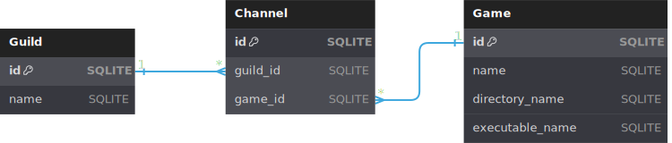

# Discord bot to manage a server dedicated to games
> Python implementation of a Discord bot to manage an Ubuntu server dedicated to hosting game servers.

## Table of Contents
* [Disclaimer](#disclaimer)
* [Additional information](#additional-information)
* [Most notable features](#most-notable-features)

## Disclaimer
The bot might not work out of the box because it has not been coded to make it. The code was made to work on my server; however, you are free to obtain a copy of this code and edit it or do what you consider.  
The software is under the [MIT License](LICENSE.md).

## Additional information
- The code is written with the Discord.py package and uses the subprocess module to execute bash commands.
- The SQLite database have the following Entity–Relationship model:

- The creation and registration of a Minecraft JE server is implemented in the code. If another game server wants to be added, it should be added manually creating the directories, setting up the server, and adding the values to the database.
- The code is made to work with two game servers (tested with Minecraft JE and Project Zomboid).
- A previous installation and configuration of pCloud Console Client should have been made to use the `backup` and `latestb` commands.
- GNOME Display Manager (gdm3) should have been installed to use the `stream` command. [Sunshine](https://github.com/LizardByte/Sunshine/tree/v0.21.0) has been set up to start with GNOME.

## Most notable features
### Games server related features
- Run and stop a server.
- Backup of all server files with pCloud.
- Check if a server is running.
- Check if there is a pCloud backup running.
- Send commands to the running server.
- Check the date and time of the latest backup.
- Set up a Minecraft JE server.
- Delete a Minecraft JE server.

### Various
- Message if a command does not exist.
- Comment about private messages.
- Only allow Discord guilds messages.
- Hibernation, reboot or boot to windows.
- Avoidance of running a server when another one is running.
- Avoidance of running a server when a pCloud backup is running.
- Avoidance of running a server backup when a pCloud backup is already running.
